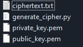
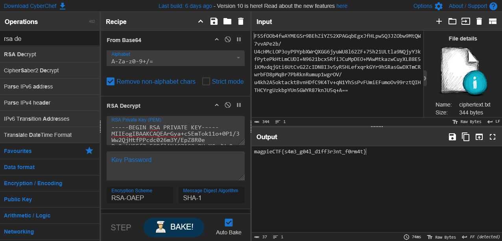

# All Ends Same - Category: Crypto

>Christina Krypto's Diaries:
>
>"Despite our differences, Professor Richard Hash and I are working towards the same core goal: secure communication. The irony is that, in the end, cryptography—whether through his traditional methods or my evolving approaches—always comes down to the same fundamental “format”: transforming data into something unrecognizable to anyone who doesn’t have the key to decrypt it. Whether you use numbers, text, or any other form, cryptography boils down to one principle: securing information by making it unreadable without proper authorization. The formats may change, but the underlying idea remains the same—data must be protected from unauthorized access. It’s this constant need for security that binds our work, even when our methods diverge."

Inside the provided zip file, we've got a lot of interesting files here.



What immediately stands out is the private_key.pem file. Whatever the ciphertext is, I'd guess it's encrypted using that key. How nice of them to provide that! Let's have a look at the generate_cipher.py file which we'd assume is what created the ciphertext file.

```python
# generate_cipher.py
from Crypto.PublicKey import RSA
from Crypto.Cipher import PKCS1_OAEP
from base64 import b64encode as be

# generate RSA keypair
def generate_rsa_keys():
    key = RSA.generate(2048)
    private_key = key.export_key()
    public_key = key.publickey().export_key()
    return private_key, public_key

# first pad encrypted text with OAEP then base64 encode it
def encrypt(public_key, message):
    key = RSA.import_key(public_key)
    cipher = PKCS1_OAEP.new(key)
    ciphertext = cipher.encrypt(message.encode())
    ciphertext = be(ciphertext)
    return ciphertext

# Generate key
private_key, public_key = generate_rsa_keys()

# Read flag
message = open('flag.txt','r').read().strip()

# Encrypt flag
ciphertext = encrypt(public_key, message)

# Write keys and ciphertext to files
f=open("private_key.pem", "wb")
f.write(private_key)
f.close()

f=open("public_key.pem", "wb")
f.write(public_key)
f.close()

f=open("ciphertext.txt", "wb")
f.write(ciphertext)
f.close()
```

The important function of note is the encrypt function. From what we can gather from the code, it seems like the flag is encrypted using RSA and then encoded into base64 before being output into the ciphertext.txt file that we have. All we should have to do is reverse the process! Let's use CyberChef to do just that. All we should have to do is use the `From Base64` and the `RSA decrypt` operation. We can simply use the given private key file. Here's a [link to the CyberChef recipe](https://gchq.github.io/CyberChef/#recipe=From_Base64('A-Za-z0-9%2B/%3D',true,false)RSA_Decrypt('-----BEGIN%20RSA%20PRIVATE%20KEY-----%5CnMIIEogIBAAKCAQEArGya%2BcSEmTok11o%2B0P1/3Ww2QjHtfPPcdc026m3Y/EpZ8R0e%5CnPqOptUSFfZr5CPflAN4C71G8eRHoXCodVpQwpM9V2F2DlTZkx7lGUtL0dQfya7cD%5CnLlWGGfHUFZSkctBYF/o89k5vjsQ0gsd5BHlpRXr%2BPXsFiN%2BNpNmr387b49eKwaC5%5Cnb4A4mg9nErITxzMqMXbmjnNWfkYCTHsloi4n5rW0j/JcX6PEbL%2B70Q3hE6db6NG2%5Cnv3LMfiCqxM4fK0DvVgOVzAMEzIn%2B1adZKOAMLO2mf22ZZaZ0wwrf%2B7BTuaJpkx%2Bz%5Cn3RijQYSyU/CGdHgdM/ZZoMSk8bE6fsJ90TVRRQIDAQABAoIBAEDDwIhtrOLDKMBt%5CnKOgmN%2BeLNGwzxcEn9hiXfveaUCUfpl3/MnOT1PR96uhNlBouxulG%2BvI6kOEm/VDV%5CnDtUM76KQMG4HXhvnZP5yFLyaeXEWDZQxF3RJcof/Qkri3Mw1fslu2IQp3RRSlWjE%5CnFSw9kHGlK6cbNO5/DfysODdmQ0j2eD1uHAs8xDwL0op55ctbkGLubRHj0b4BxltQ%5CnWXwJRavjuMpjfRphdl0p3%2B5wFvEqEiodv%2BJPFBYYPIYrtBEhSGPLqBvz5MFWGZ5w%5Cni15QJd61LCceeWW8dmMzxdzdmdZq2nb3tbEd0T15MnM%2BZ7iwBk5bTz%2B1ZvJyCo4S%5Cn8hYl52cCgYEAwJWT5kBYgipbgLZDQTDDm/kNpa4lUiKJcr2EecTaif/LoB/XxGTz%5CnoC6TF4DJlyLfrekd09hrlry01w7lg/wxC4/xSrZsTA5pbEqNVQMMoGfV68Uxb8a5%5CndqQ9ivjMTdQ/rep74mvmjtRYGvIEySFsdHVvGBV2Q0R7v2DGglAMXx8CgYEA5TOU%5Cnt0IC7gdqaSHNDhykpdZ1vkU6ZvKbiIWyCAbAH5Jx//Mek6eHDO0CP0dj%2Bjm7iOmE%5CnJGCVXLsu7mrjpfme1hT44g7wL8dLwccRnYl%2BqbSuiiSe8TzRbBajBAYFdz7Z0GcI%5CnXUQBHswGE9WTVWFQ%2B4PtAQEm7efKIby3ro60lxsCgYAl%2B9qF6V8LnUsa4df1/aY3%5CnFzIn4WcfAgzWAqckVT09RqRk2qL162tZxpXgZthb5Nb1OCtX4zGlM2b/m8KM%2B6q4%5CnuxU%2BRSiq/5SvdSzW/Zj58kDxFZ2gjDN8QPyacmPpXdmJddwlVl7NAPi3p9Bl0x/P%5CnAHJ%2B74y5y8IUhwPgI%2BWsxQKBgFlMtX6JC5ct8Hmxn7EF2%2Bh5HDrbwhtmHs8cN/cE%5CnmkoyxpPQZ3Nj7CxPE3cQG5XcdIKtaLy7nLYaf/iIUNXT4dzLIwUAiPg0kAGZy/Uz%5CnItR//xj3l62p4nZYg38H0Y1aQYb%2B/bVIz57uItgLeHHljqXQCsE/b6l1i72FR5ON%5CnKjNNAoGAAPFpVd%2B9ZogI463ziDhrGSmqrGEjtoPpfltb/om1QV6Nb35LIOUjRskh%5CnL/RG%2BikfNKeci2yXA9iRg46FVEJWYtkAIbZGTqeQkAZb83H3ksgAr4%2BuCSV0eRu0%5Cnz5Ql%2BWxo9gYqs1SWZCjyXurwWKfOl/oWyhCmgQ8Jsy1ASrrYyV8%3D%5Cn-----END%20RSA%20PRIVATE%20KEY-----','','RSA-OAEP','SHA-1')&input=RjVTZk9PYjRmd0FZTUVHU3I5QkVoWmlZWjUyWFBBR3FiRWd4SmZITHB3NVEzSlpPYnc5TXRRVzd2dkFQZTJiL1U0Y0hNY0xPUDNveVA5WXBiWFdyUVhHRzZqeXVXVThsNjJaRis3NWgyMVVMdGxhOU5RanlZM2tmUHl0ZVBrSHRMbUNVREkrTjk2MjFiY3g1UmZpSkN1TXBERU8rTUF3TXRrYXp3Q3V5WExCOEU1aUtNdmRxakd0aTZVdEN2RzJaY0lETjhJM3Y1eVI1SExlZnhxcmtHWXI5aFNSYXNHd0RYVG1DUndyYkZEOHBNcUJyN1BiUmtuUnVtdXAxd2dyT1YvdTRraDJBNW9rdGFja3RCdm5IRGZDOUs0VHYrcU4xWWhTc1B2RlVtaUVGdW1vT3Y5OXJ6dFFJSFRIQ1lyZ1V6a2JwWVVuNUdXWVI4N2tuSlU1cStBPT0&oeol=FF) to do just that.



Easy peasy!

**Flag:** magpieCTF{s4m3\_g04l_d1ff3r3nt\_f0rm4t}
