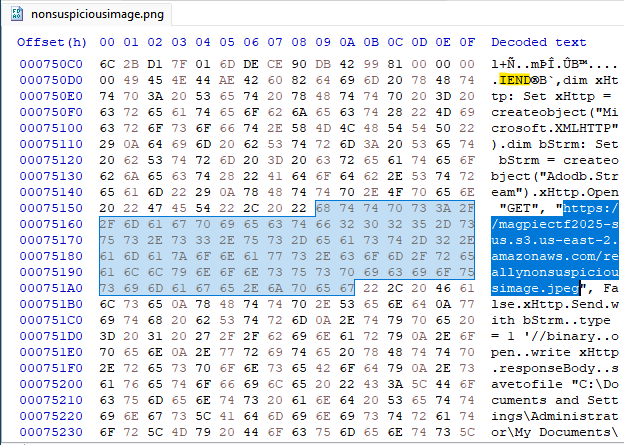

# Cat Pics - Category: Forensics

>New email from cors@nypd.gov:
>
>We were sent a USB to the precinct from someone who claims to be from within the Krypto Foundation, their claim is that it contained leaked messages from within the Company. However it appears to contain unrelated information, it could be a prank, try and make something of it.
>
>Edward Cors - NYPD

I will say, an image with the name `nonsuspiciousimage.png` definitely isn't suspicious at all. Opening the file, we're greeted by an interesting image of a cat. 

There's nothing terribly of note that we can immediately notice. Let's run it through exiftool and see if we've got any interesting metadata.

There's a weird warning about trailer data after the PNG IEND chunk. That means there's data in the image file that goes beyond the actual image data! Let's open it in a hex editor and have a look.

I've highlighted the IEND chunk which shows where the PNG data ends. It looks like there's some weird code at the end of the file including a URL to some page! If we navigate there, we get another image file, `reallynonsuspiciousimage.jpeg`, containing a text message conversation between someone named "Madam Exploit" and "Ten_Se7en". If we run this image through exiftool as well...

Does anyone know what "CONFIDENTIAL DO NOT SHARE" means? Anyway, we can see the flag now (three times as a matter of fact).

**Flag:** magpieCTF{p1ctur36\_In\_PicTuR37}
