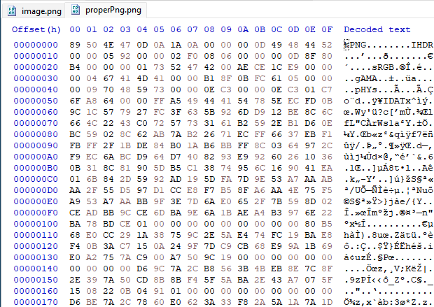

# Corrupted image - Category: Forensics

> The given image will not open properly, even though it is a standard .png file! Your job is to extract the information from the image

Indeed, opening the image definitely does not work. I tried a couple of different image viewers and none of them seem to work. Exiftool also does not work, giving a file format error. Let's take a look at the file in a hex editor. I'll use HxD here.

Just scrolling through the hex code isn't terribly helpful since I'm not a robot. At the very least, there does seem to be some kind of data here but who knows how it's corrupted. At the end of the file, we can spot the IEND chunk (which should be present at the end of a PNG) so that is a good sign that it is indeed a PNG.

To compare, let's try opening a proper PNG file and see if we can see any differences.

It seems like the very first byte is different between the two files. The proper PNG starts with 0x89 while the corrupted one starts with 0x98. Checking with a few other random PNGs, we can see they all start with 0x89. Let's quickly verify by looking up the proper PNG header.

The wikipedia page for PNG files shows that they should start with 0x89! Let's change this in our corrupted PNG and see if that helps. After making the change and trying to open the file...

*Now we're in business.*

We're greeted with a QR code! If you're smart, you can use something like [CyberChef](https://gchq.github.io/CyberChef/) or any online tool to read the QR code image. Or... you can be like me, scan the QR code with your phone, and read the flag manually.

*Maybe not my brightest idea but it did work.*

**Flag:** magpieCTF{h3x-3d!t-fix}
