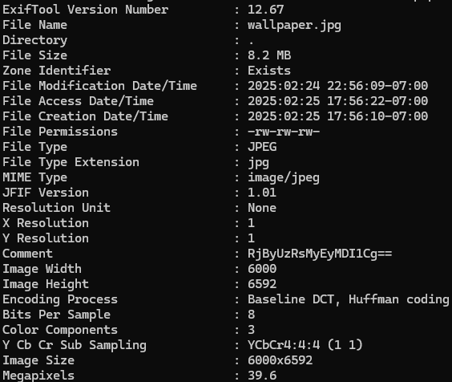
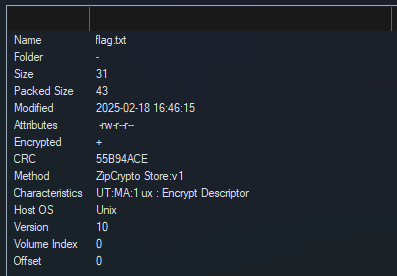
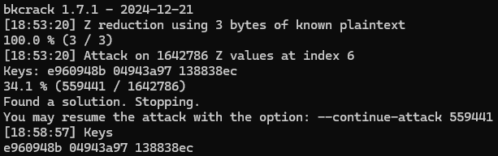

# Deed of Desperation - Category: Forensics

>New email from cors@nypd.gov:
>
>Cyber-Solutions was once the top name in security, but ever since Krypto arrived, the company has been struggling. Terry claims Krypto is undercutting his prices and stealing customers without making a profit. His quiet frustration has turned into public outrage as he fights to keep his business afloat.
>
>We suspect that the file attached contains information about Blue's finances, but we have not been able to extract it.
>
>Edward Cors - NYPD

We're provided a single wallpaper.jpg file. Visually inspecting the file doesn't reveal anything immediately obvious. With image files, the first step is to always inspect the metadata. Images can store a lot of information within them. Stuff like when the picture was taken, GPS coordinates, the device that took the photo, etc. Let's use **exiftool** to have a look at the metadata.



Aha! The comment field reveals a suspicious encoded string. I've seen enough base64 to know it when I see it. We can throw that into a base64 decoder to reveal the string ```F0rS4l3!2025```. Trying ```magpieCTF{F0rS4l3!2025}``` as the flag wouldn't work though, as much as I wish it did.

After a bit of head banging and revisiting the challenge later, we eventually ended up discovering an [online steganography decoder](https://futureboy.us/stegano/decinput.html). Putting in the image with no password ended up revealing a zip file hidden within the image! Note that this online decoder seems to just use steghide behind the scenes so we could have used that instead.

Opening the zip file reveals two files hidden within. flag.txt and form.pdf. Unfortunately, they're encrypted behind a password. Trying the comment we found earlier as the password didn't work so we still have some work to do.

Fortunately for us, there are many vulnerabilities in certain kinds of encrypted zip files. We can inspect the properties of flag.txt inside Nanazip (fork of 7zip that I use) to reveal what compression and encryption methods were used.



We can see the file was compressed with the ZipCrypto encryption method and compressed using the Store method. ZipCrypto is an old zip encryption algorithm that can be vulnerable to plaintext attacks. As long as we know at least 11 bytes of the plaintext in that file and the file wasn't compressed (i.e. Store method was used) we can try to crack the keys!

Since we'd imagine this file should contain the flag, we know that it should start with `magpieCTF{`. You might notice though that this isn't quite enough yet as this is only 10 bytes. However, we also know that the last character of the file most likely is a `}` which gives us 11 bytes. We can eek out another byte by knowing that most Linux text editors will always terminate a textfile with an extra newline character at the end of the file. Windows editors such as notepad don't usually do this. So we have 12 bytes total. Perfect.

We can use a fun tool named [bkcrack](https://github.com/kimci86/bkcrack) to crack the zip open. Here's the command we used:

```bkcrack -C flag.zip -c src/flag.txt -p plain.txt -x 29 7D -x 30 0A```

plain.txt contains the starting plaintext, `magpieCTF{`. The -x argument allows us to specify known bytes at specified offsets. We know that the 29th byte should be a `}` and the 30th, last byte should be a newline character. The zip file properties earlier told us the size was 31 bytes total which makes the 30th byte the last one (since the "first" byte is byte 0). After a couple minutes of crunching, we get a result!



Now we can use the following command to strip away the password from the zip file.

```bkcrack -C flag.zip -k e960948b 04943a97 138838ec -D flagnopass.zip```

Now that we have our unlocked zip file, we can unzip the contents and reveal our flag!

**Flag:** magpieCTF{WH4T\_D1D\_T3RRY\_S1GN}

The form.pdf reveals that Terry Blue seems to have been selling his home. Maybe his finances aren't looking so great.

## Pitfalls:
We stumbled into quite a bit of trouble just after finding the comment in base64. It turns out that this comment didn't have anything to do with the solution (?). For quite a while, our team was running around in circles trying to figure out what this comment had to do with the problem. It didn't help that we did try to use `steghide` rather early on, except instead of providing a blank password, every time I used it, I provided it with either the base64 string as the password or the decoded one... It took quite a while to figure out that actually, if we just didn't give it a password, it would work. Sometimes things are less complicated than we like to think!
