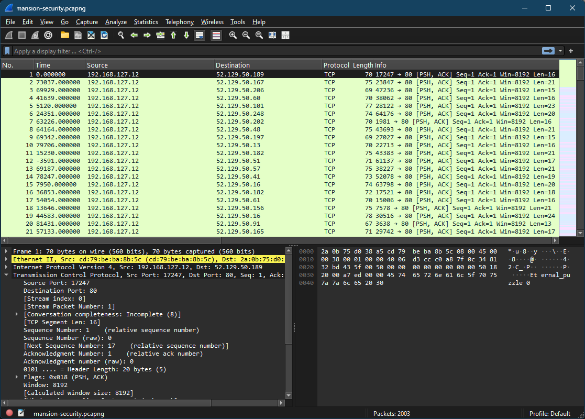
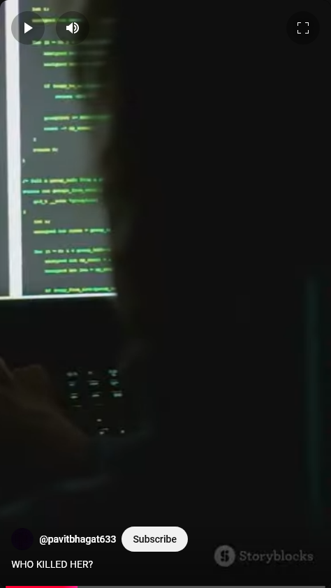
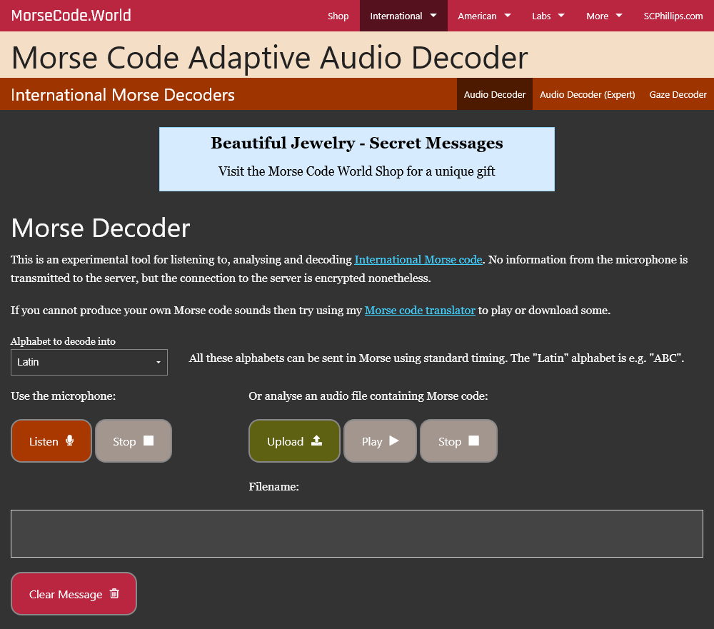
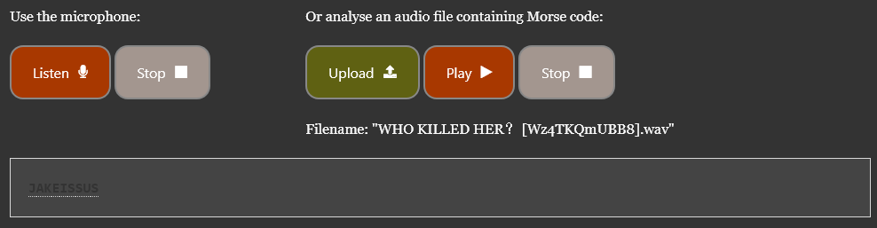

# Mansion-Recovery - Category: Forensics

> New email from cors@nypd.gov:
>
>We think we have found signs of how Krypto's Mansion Security was compromised, a PCAP file was recovered.
>
>Analyze it for anything of note.
>
>Edward Cors - NYPD

The file we're given is a packet capture, mansion-security.pcapng. Let's open it up in Wireshark and have a look.



We've got tons of TCP data in here. Taking a look at the hex data on the bottom right, we can see the string "Eternal_puzzle 0". Similar strings can be found as we scroll through the TCP traffic. Let's keep going for now and see if we find any interesting strings.

After a bit of scrolling, we hit packets 26, 27, and 28 which reveals the strings ```MAGPIE{Part1-aHR0cHM6Ly95b3V0dW```, ```Part2-JlLmNvbS9zaG9ydHMv```, and ```Part3-V3o0VEtRbVVCQjg=}```. This *almost* looks like a flag so we must be getting somewhere. If we combine the strangely encoded characters together from the three parts, we get ```aHR0cHM6Ly95b3V0dWJlLmNvbS9zaG9ydHMvV3o0VEtRbVVCQjg=}```. As always, we're contractually obligated to throw any suspicious string into a base64 decoder which ends up revealing ```https://youtube.com/shorts/Wz4TKQmUBB8```. Interesting!



The video seems to be some generic stock footage but what's more interesting is the audio. The characteristic long and short tones are recognizable anywhere! My first thought is to painstakingly attempt to transcribe the code manually before then translating it into letters. But, as a team member pointed out, we can likely find some tools that'll automatically decode it for us. Let's see if one exists.

The first result of searching "morse code audio decoder" brings us to the [following lovely site](https://morsecode.world/international/decoder/audio-decoder-adaptive.html).


*An experimental tool you say?*

Perfect. Seems like this should hopefully work! Let's download the shorts audio using YT-DLP and feed it into the decoder. The output from YT-DLP is a webm file, so we can use Audacity to easily convert it to a wav file. After throwing the file into the decoder and hitting play...



Terrible font colour aside, we get the message ```JAKEISSUS``` which turns out to be the flag!

**Flag:** magpieCTF{JAKEISSUS}
