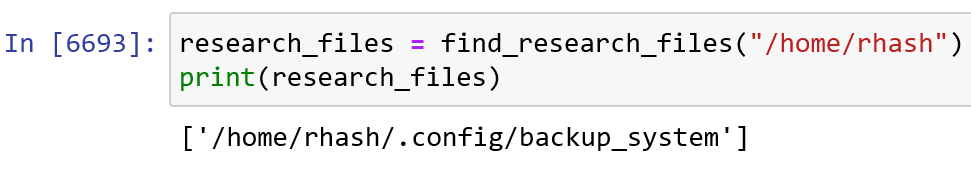

# The Notebook's Secret - Category: Forensics

>Another late night at the precinct, another piece of evidence to sift through. This time, it's Professor Richard Hash's research notebook. Your partner, Edward Cors, leans back in his chair. "I don't know, this feels like it's pointing straight at Hash. The guy's always preaching about transparency, about making everything public. Maybe he decided to take matters into his own hands." But something about the notebook catches your eye. The last entry, dated February 21st, 1933, one day before Krypto's murder, hints at an unexpected development. It seems Krypto and Hash were on the verge of announcing something big.
>
>SSH Port is 2222.

What I find already interesting is we're given an SSH port. Let's keep that in the back of our minds for now. Browsing to the link given reveals a Jupyter Notebook instance with a single notebook.ipynb. Inside this file lies some notes, presumably from Richard Hash, and some Python functions.


Reading the notes, it seems like trying to get ahold of these "access credentials" could be a good idea. The find_research_files function seems to already be setup to look for backup files so perhaps it could help us here.

The question is, can we actually execute Python code? Adding a new cell, we can see that this is indeed the case. Let's try running the functions as given in the example usage.



Seems like we do have some backup files! We can list the files in that folder to see a suspicious looking ".keys" folder. Inside this folder lies an SSH private key! Most likely it corresponds to ckrypto's account. I would show you but seems like someone deleted it so I can't grab an image of it to show here. But I do promise it was there when I solved the challenge.


*Sabotage!*

After that, we can simply SSH into the machine, logging in as ckrypto, and using the private key we obtained.

```ssh ckrypto@challenges.magpiectf.ca -p 2222 -i <path to private key>```

After snooping around in ckrypto's home directory, we can find a suspicious looking ```.private``` directory, and within it, the flag!


**Flag**: magpieCTF{cryp70_k3y_4cc3ss_gr4nt3d}

## Sidenotes
You can actually SSH in as rhash if you add your own SSH private key to rhash's home directory. This can easily be done through Python. I actually did this at first when I initially solved this challenge since the backup directory was completely empty back then too. Someone really loves sabotaging this challenge. I didn't really know what to do but I knew it had something to do with SSH so I tried to inject my own private key. After logging in and poking around for a while, I noticed the challenge was fixed and I was able to obtain ckrypto's private key from the backup folder mentioned.
