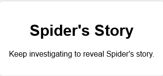

# cookie-trail - Category: Web

>New email from cors@nypd.gov:
>
>Jake Kaylined has had many aliases over the years, and Krypto has dealt with many of his online persona throughout her career. One such persona was "Spider". We believe that her involvement with this alias of Jake's might have relations to the case.
>
>Investigate the casefile regarding Spider and Krypto.
>
>Edward Cors - NYPD

We're greeted by a rather blank looking page. I don't know about you but it really seems like it wants us to look at our cookies. Let's do just that.

Nothing? Well, I suppose it would be too easy if there was something there. Taking a look through the HTML source doesn't reveal anything particularily interesting. Let's try just inputting something random and hitting search on the site.

Maybe now we'll have something in our cookies? And indeed we do!

My immediate thought is to try and mess around with this cookie. Let's just try changing the value to 1 and see what happens. If we do that and reload the page, we get a new part of the story!

If we keep increasing the number and refreshing, the story continues. After inputting a value of 10, we get the following:

Nice!

**Flag:** magpieCTF{chr15t1n@\_3xp0$3d\_$p1d3r}
