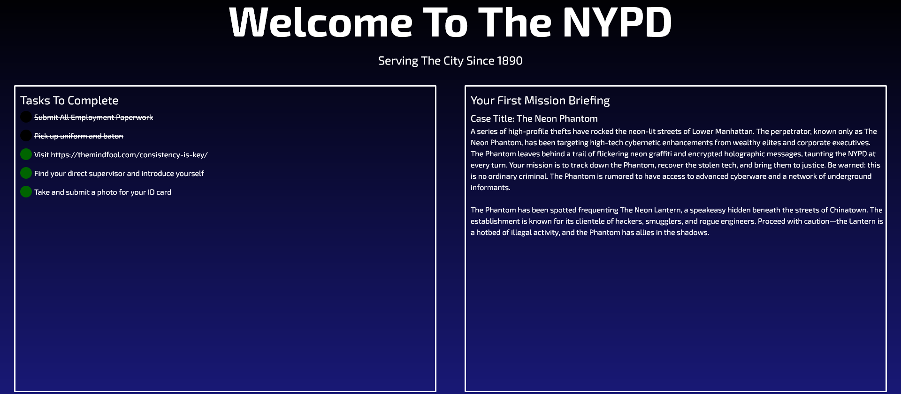
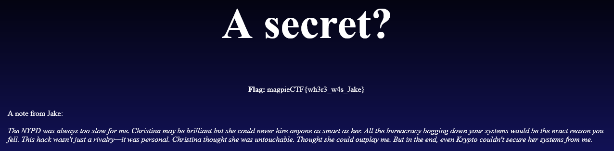

# cops-like-ciphers-and-cookies - Category: Web

>New email from cors@nypd.gov:
>
>We believe that there is a vulnerability within the NYPD landing page, that has been overlooked for way to long. Not only that but it was exploited within the days following Krypto's murder.
>
>Check to see what the vulnerability is, and if it has anything to do with our suspects.
>
>Edward Cors - NYPD

Checking out the given site, we're greeted by an interesting looking landing page.



Not too much to go off of just from visual inspection. There's a weird website from themindfool which leads to an article about "Why Consistency Is Key To Success". Strange.

As with all web challenges, one of the first places to start is the good old developer tools or as I lovingly call it "Inspect element". After poking around, we can quickly find a strange looking string under the bullet point for the aforementioned article.


```V2UgbmVlZCBzb21lb25lIHRvIGZpeCAvbG9naW4sIGl0J3MgYmVlbiBicm9rZW4gZm9yIGZhciB0b28gbG9uZy4=```

We sure love base64 arond here. Decoding this string gives us the message ```We need someone to fix /login, it's been broken for far too long.```

Immediately, this tells us we should probably browse to the /login page. We're greeted by a rather funny looking "login" page. Interestingly, the username and password form fields don't seem to work.


*Let's hope that admin is feeling a little lazy*

The mention of cookies immediately gives us a clue that, well, we should look at our cookies. And indeed, we have something!


Looks like gooble-dy-goop. Seems like it's been run through some sort of cipher. At this point, our team tried a few fun ideas, including but not limited to:

1. Adding our own username and password cookies
2. Fixing the login page by unlocking the username and password fields and adding a submit button to try and login
3. Trying all manors of ciphers on the cookie to try and find out what it says

We found out fairly early on that within the head of the HTML of the site, there's another base64 encoded string.


Decoding this string leaves us with the message ```vigenere```, alluding to vigenere cipher. This likely means the browser cookie is encoded using it. But what could be the key? After being stuck here for quite a long time and coming back to the challenge later on, we realized it was staring us in the face the whole time.


Of course. Decoding the browser cookies using Vigenere Cipher and ```consistency``` as the key, we can find out that the ```Name``` field of the cookie decodes to ```current-user``` and the value decodes to ```guest```. Let's encode the username ```admin``` which encodes to ```crzav``` and place that in the value field of our cookie. Refreshing the login page and...



Success!

**Flag:** magpieCTF{wh3r3_w4s_Jake}