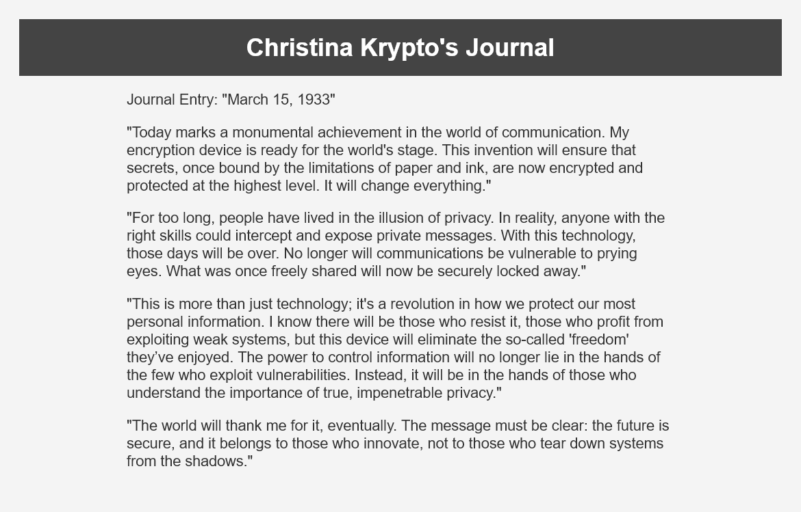
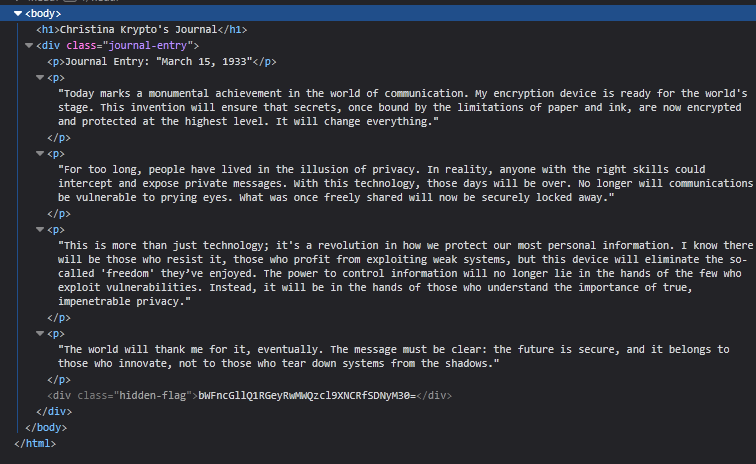

# hidden-flag - Category: Web

>New email from cors@nypd.gov:
>
>We have found one of Christina's Journals, hosted online. Take a look through it and see if you can uncover something of note.
>
>Edward Cors - NYPD
>
>Hint: Did you check for encryption?

The linked page gives a journal entry from Christina Krypto. Taking a read through it doesn't seem to reveal any info about the flag.

Let's take a look at the developer tools and see what we can find.

There seems to be an element with its contents encoded in base64 at the bottom there. Decoding it gives us the flag!

**Flag:** magpieCTF{$p1d3r_W4$_H3r3}
